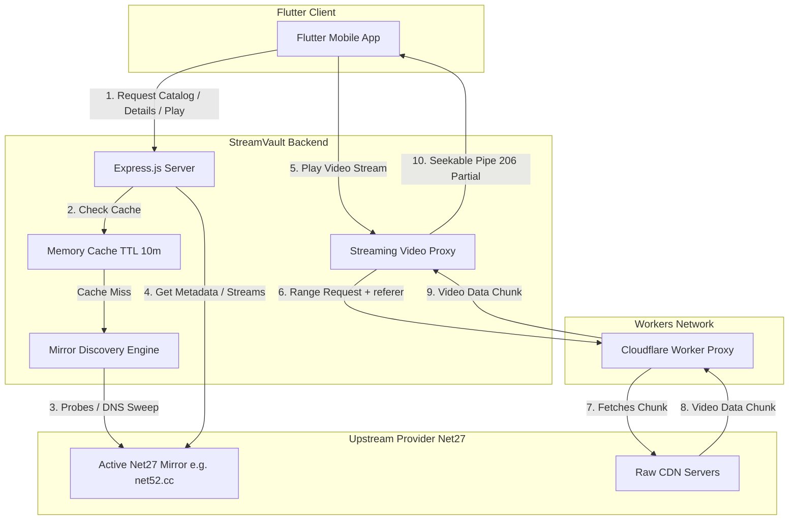
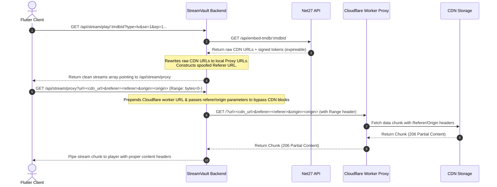

# 🎬 StreamVault Backend API Documentation

Welcome to the backend infrastructure of **StreamVault** — a high-performance, resilient API proxy and media streaming pipeline designed specifically for the StreamVault mobile client.

This service abstracts the complexity of working with dynamic third-party providers (specifically Net27), handles mirror discovery under domain-rotation events, rewrites signed expiring stream URLs, and proxies heavy video streams with full `Range` request support for smooth, seekable playback in Flutter.

---

## 🏗️ Architectural Overview

StreamVault Backend acts as an intelligent intermediary. Since third-party CDN providers restrict direct access via CORS and referer checks, and frequently rotate their domains to evade blocks, the backend handles these concerns transparently.



---

## 🛠️ Key Technical Engines

### 1. 🔍 Mirror Discovery Engine (`services/net27.js`)
Net27 domains are frequently blocked, resulting in domain rot (e.g., `net27.cc` rotates to `net52.cc`, `net22.cc`, etc.). The backend solves this by implementing an active discovery pipeline:
*   **Static Fallbacks:** Checks a prioritized list of known domains (`MIRROR_DOMAINS`): `net27.cc`, `net52.cc`, `net22.cc`.
*   **Dynamic DNS Sweep:** If all static fallbacks fail, the engine generates domain names in parallel from `net10.cc` to `net99.cc` (90 domains) and performs DNS resolution (`dns.lookup`) to find online hosts.
*   **Validation Probing:** Resolved domains are actively queried (`HTTP GET /`) to check if they are the real NetMirror catalog (verifying the HTML contains `"Search movies"` and does *not* contain `"Sign-In is Required"`).
*   **Discovery Cache:** The working domain is cached in memory for **10 minutes** to avoid the performance penalty of domain sweeps on subsequent API requests.

### 2. ⚡ Intelligent Memory Cache
To decrease upstream API request overhead and bypass rate limits, the backend implements a clean, high-performance in-memory cache system with a **10-minute Time-To-Live (TTL)**.
*   **Scoped Caches:** Dedicated memory pools for Title Details, Available Languages, Catalog Categories, and Seasons.
*   **Dynamic Expiration:** Stale keys are automatically evicted upon access when their age exceeds `TTL_MS`.

### 3. 🛡️ Streaming & Video Proxy Pipeline (`routes/stream.js`)
Net27's video files are served from highly restrictive CDNs that require:
1.  A specific HTTP `Referer` simulating their internal embedded iframe.
2.  A valid user agent.
3.  Signed URL tokens that expire quickly (cannot be statically stored).

#### Workflow of Playback:


#### The Proxy Mechanism:
*   **Rewriting Engine:** The `GET /api/stream/play/:tmdbId` endpoint rewrites the raw CDN URLs returned from upstream, transforming them into local backend proxy endpoints:
    `/api/stream/proxy?url=URL&referer=SpoofedReferer&origin=ActiveMirror`
*   **Cloudflare Worker Proxy Integration:** Requests are routed through a Cloudflare Worker helper (`streamhub-proxy.1545zoya.workers.dev`) to guarantee reliable CORS bypass and secure proxying.
*   **Range Support (206 Partial Content):** The proxy captures and forwards the `Range` headers sent by video players (e.g. `Range: bytes=1048576-`). It streams the media chunk back to the client with appropriate headers (`Content-Type`, `Content-Length`, `Content-Range`, `Accept-Ranges`), enabling seek/rewind capability and instant buffering on mobile players.
*   **Memory Safety & Connection Cleanup:** Listens to client connection closes (`req.on('close')`) to abort the backend-to-worker connection immediately, preventing socket/resource leaks.

---

## 🛣️ API Endpoints Reference

### 📁 Catalog Routes (`/api/catalog`)

#### 1. Trending Items
*   **Endpoint:** `GET /api/catalog/trending`
*   **Description:** Returns curated trending media containing hero banners and content rails.

#### 2. Categorized Catalog
*   **Endpoint:** `GET /api/catalog/category/:tab`
*   **Parameters:** `:tab` (e.g. `netflix`, `prime-video`, `hulu`, etc.)
*   **Description:** Returns curated platform-specific titles.

#### 3. Hybrid Search
*   **Endpoint:** `GET /api/catalog/search`
*   **Query Params:**
    *   `q` (string, required) — The search keyword.
    *   `page` (number, optional) — Defaults to `1`.
*   **Description:** Searches titles across movies and TV series, returning metadata and direct watch status.

#### 4. Title Details
*   **Endpoint:** `GET /api/catalog/title/:type/:tmdbId`
*   **Parameters:**
    *   `:type` — `movie` or `tv`
    *   `:tmdbId` — TMDB identifier
*   **Description:** Fetches comprehensive info (overview, runtime, cast, backdrop). For TV series, lists available seasons.

#### 5. Season Episodes
*   **Endpoint:** `GET /api/catalog/season/:tmdbId/:seasonNumber`
*   **Description:** Lists all episodes for a specific season of a TV show.

---

### 🎥 Streaming Routes (`/api/stream`)

#### 1. Language Variants
*   **Endpoint:** `GET /api/stream/languages/:type/:tmdbId`
*   **Parameters:** `:type`, `:tmdbId`
*   **Query Params (Required for TV, omit for movies):**
    *   `se` (season number)
    *   `ep` (episode number)
    *   `sid` (subjectId)
    *   `dp` (detailPath)
*   **Description:** Retrieves audio language options (dubs/subs) available for playback.

#### 2. Get Playback Stream Info
*   **Endpoint:** `GET /api/stream/play/:tmdbId`
*   **Query Params:** Same as above (`type`, `se`, `ep`, `sid`, `dp`). Pass a specific `sid` (dubSubjectId) from languages to play dub audio.
*   **Description:** Retrieves the stream configuration. All CDNs are automatically transformed into backend proxy routes.
*   **Response Format:**
    ```json
    {
      "ok": true,
      "tmdbId": 550,
      "title": "Fight Club",
      "type": "movie",
      "year": 1999,
      "mp4": "https://ott-backend-eg8y.onrender.com/api/stream/proxy?url=...",
      "resolution": "1080",
      "streams": [
        {
          "url": "https://ott-backend-eg8y.onrender.com/api/stream/proxy?url=...",
          "resolution": 1080,
          "size": 646186864
        }
      ]
    }
    ```

#### 3. Media Proxy Stream (Range-Compatible)
*   **Endpoint:** `GET /api/stream/proxy`
*   **Query Params:** `url`, `referer`, `origin`
*   **Headers Supported:** `Range`
*   **Description:** Proxies raw media data, simulating all target headers to satisfy upstream constraints while servicing standard client seeks.

---

## 🚀 Environment and Deployment

*   **Runtime:** Node.js (Express.js)
*   **Local Run Script:** `npm run dev` (utilizes `nodemon` for instant restarts)
*   **Production Deployment:** Hosted on **Render** at `https://ott-backend-eg8y.onrender.com`
*   **Environment Variables (`.env`):**
    *   `PORT`: Port to run the server on (default `5000`).
    *   `BACKEND_URL`: The host URL used to format and prefix proxied playback URLs.

---

## ⚡ Error & Rate-Limit Resiliency
1.  **Upstream 429 Handling:** When Net27 triggers an API rate limit (`HTTP 429`), the service catches the error, delays for **3 seconds**, and transparently retries the query to ensure user flow is uninterrupted. If it continues failing, it gracefully propagates a sanitized 429 JSON response.
2.  **Server Timeout Guard:** Network requests to Net27 feature an aggressive 10s timeout window, preventing blocking requests from freezing the main Express event loop.
3.  **Active Connections Cleanup:** If the client exits or changes the video during proxying, the backend immediately terminates the upstream connection to conserve bandwidth and prevent server thread starvation.
